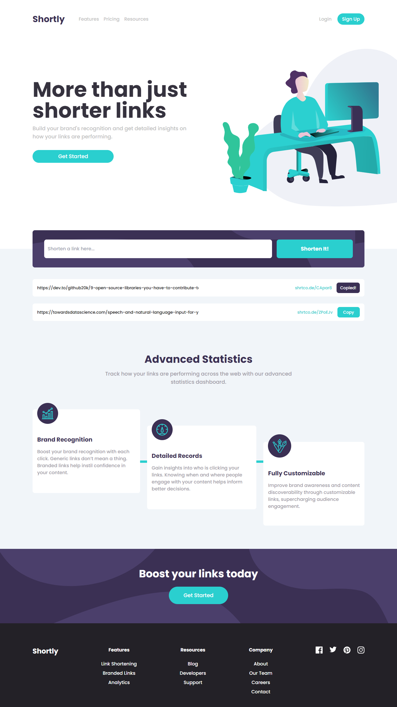

# Frontend Mentor - Shortly URL shortening API Challenge solution

This is a solution to the [Shortly URL shortening API Challenge challenge on Frontend Mentor](https://www.frontendmentor.io/challenges/url-shortening-api-landing-page-2ce3ob-G). Frontend Mentor challenges help one improve their coding skills by building realistic projects. 

## Table of contents

- [Overview](#overview)
  - [The challenge](#the-challenge)
  - [Screenshot](#screenshot)
  - [Links](#links)
- [My process](#my-process)
  - [Built with](#built-with)
  - [What I learned](#what-i-learned)
  - [Continued development](#continued-development)
  - [Useful resources](#useful-resources)
- [Author](#author)
- [Acknowledgments](#acknowledgments)


## Overview

### The challenge

Users should be able to:

- View the optimal layout for the site depending on their device's screen size
- Shorten any valid URL
- See a list of their shortened links, even after refreshing the browser
- Copy the shortened link to their clipboard in a single click
- Receive an error message when the `form` is submitted if:
  - The `input` field is empty

### Screenshot




### Links

- Live Site URL: [URL Shortener](https://url-shortener-app-site.netlify.app/)

## My process

### Built with

- Semantic HTML5 markup
- CSS custom properties
- Flexbox
- React Hooks
- Mobile-first workflow
- [React](https://reactjs.org/) - JS library
- [Tailwind CSS](https://tailwindcss.com/) - CSS Framework

### What I learned
 
I learnt how to set items in the local storage and get items from the local storage. Learnt how to use apply copy items to the clipboard. Further increased my understanding of React UseEffect Hooks. 

```some react code I am proud of
```
```
```
```js
if (data.ok) {
        const newLink = { original: inputValue, shortened: data.result.short_link, copied: false };
        setShortenedLinks((prevLinks) => [...prevLinks, newLink]);
        setInputValue("");
        setErrorMessage("");
        setCopied(false); // Reset the copied state for the new link

        // Save the updated list to local storage
        localStorage.setItem('shortenedLinks', JSON.stringify([...shortenedLinks, newLink]));
      } else {
        setErrorMessage('Failed to shorten the URL. Please try again.')
      }
```

### Continued development

I would like to continue practicing with React Hooks and transition to back end development.


### Useful resources

- [Stack Abuse](https://stackabuse.com/storing-to-localstorage-in-react/) - This helped me learn how to store key-value pairs in the local storage and retrieve them.
- [W3 schools](https://www.w3schools.com/howto/howto_js_copy_clipboard.asp) - This is an amazing article which showed me how to copy items to the clipboard.

## Author

- Website - [Megan Kullu](https://megankullu.netlify.app/)
- Frontend Mentor - [@MeganKullu](https://www.frontendmentor.io/profile/MeganKullu)
- LinkedIn - [@megankullu](https://www.linkedin.com/in/megankullu/)

